## Preview

If you have several Docker containers running on your own server and these containers are somehow important,
you have to monitor all containers to prevent your containers from being stopped suddenly. 
Docker supports various logging driver, 
so it  make you store your container's log in one spot and see the log at a glance.

Let me show one example that store all container's log on my host machine.

First, I will create and run mysql and nginx container and make these containers record there log to syslog file on the host.
Before doing this, 'rsyslog' package must be installed on the host machine and you have to open syslog port.


#  /*  Pull Docker Images for 'mysql:5.7' and 'nginx:latest'  */
#  docker pull mysql:5.7
#  docker pull nginx:latest
#
#  /*  Run new 'mysql' with syslog log-driver  */
#  sudo docker run -d --name mysql --hostname mysql  \
#                  --log-driver syslog \
#                  --log-opt syslog-address=udp://192.30.1.4:514 \
#                  --log-opt tag=docker.container.mysql \
#                  -e MYSQL_ROOT_PASSWORD=password \
#                  mysql:5.7
#
#  /*  Run new 'nginx' with syslog log-driver. You can record nginx log by access the nginx web.  */
#  sudo docker run -d --name nginx --hostname nginx \
#                  --log-driver syslog \
#                  --log-opt syslog-address=udp://192.30.1.4:514 \
#                  --log-opt tag=docker.container.nginx \
#                  --publish 192.30.1.4:8000:80 \
#                  nginx


Here is the result of executing commands above.

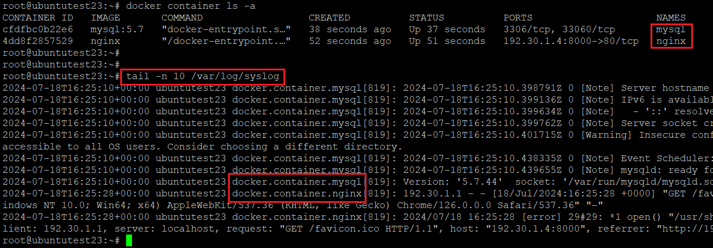

As you can see, each container send its logs to the host successfully but these logs have a different format.
So, If these logs are required to be analysed, somebody has to make some code to parse each logs. Yes. It is very annoying to do.

  
## Fluentd

Fluentd is an open source software to unify different types of logs,
so it is widely used for collecting and unifying data as well as logs.
Not only collecting data or logs, it can also do forwarding its collectings to database such as MySQL or MongoDB.
Generally, people who are working in related industry tends to collect unstructured data so that they use so called NoSQL Database to store collections.

Fluentd can be also used in Docker, because Docker also support Fluentd Image on its official hub site.
However, official image does not have any plug-in to connect DB applications, it requires some work after pulling image.

In this post, I will show how to store all container logs on NoSQL - with MongoDB - Database Container.

  
## Protocols - To store unified container's log on NoSQL database
<fieldset>
<labels>[ Summary ]</labels> 
<a href="#prtc1">1. Test Environment</a> 
<a href="#prtc2">2. Architecture</a> 
<a href="#prtc3">3. Prerequisite</a> 
<a href="#prtc4">4. Create and Run MongoDB Container</a> 
<a href="#prtc5">5. Create New Fluentd Image and Run Container</a> 
<a href="#prtc6">6. Run Container and Collecting Logs</a> 
</fieldset>

  
### 1. Test Environment
<table>
    <tr>
        <td style="width: 200px;">- Host OS</td>
        <td>Linux, Ubuntu 22.04</td>
    </tr>
    <tr>
        <td>- Host Machine's IP</td>
        <td>192.30.1.4 (VM Virtual - NAT)</td>
    </tr>
    <tr>
        <td>- Docker Version</td>
        <td>Docker version 25.0.2</td>
    </tr>
    <tr>
        <td>- MongoDB Image</td>
        <td>mongo:latest (a31b196b207d)</td>
    </tr>
    <tr>
        <td>- Fluentd Image</td>
        <td>fluent/fluentd:edge-debian (84910c79487a)</td>
    </tr>
    <tr>
        <td>- MySQL Image</td>
        <td>mysql:5.7 (5107333e08a8)</td>
    </tr>
    <tr>
        <td>- Nginx Image</td>
        <td>nginx:latest (fffffc90d343)</td>
    </tr>
    <tr>
        <td>- Docker Network</td>
        <td>Default Host Bridge (Docker0)</td>
    </tr>

</table>

  
### 2. Architecture
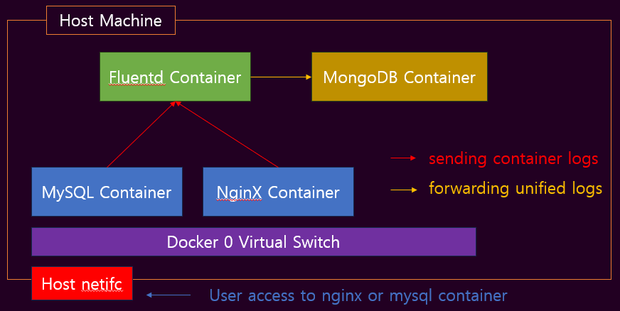

Nginx and MySQL container send their own logs to Fluentd Container with destination port 24224.
Fluentd container reconstruct the structure of received logs and forward them to MongoDB with destination port 27017. 

  
### 3. Prerequisite

(1) Firewall-cmd Setting for 'docker0' Zone  

After installing docker, you can see the zone named 'docker' on the host's firewall.
It has a target 'ACCEPT' as a default, which means firewall on the host does not block any traffic to docker.

If the target of zone 'docker' is not set as 'ACCEPT' you will face some problems in terms of running or accessing container.
I recommend to change target as a 'ACCEPT' if you are not familiar with linux firewall-cmd and docker network. 


#  /* Check the firewall target for zone 'docker'  */
#  sudo firewall-cmd --list-all --zone=docker | grep target 
#
#  /* Change firewall target for zone 'docker' and reload firewall-cmd service */
#  sudo firewall-cmd --set-target=ACCEPT --zone=docker --permanent
#  sudo firewall-cmd --reload


Also, You have to access index webpage which nginx container provides in order to get web access log. Therefore, you also have to accept traffic via host's nginx port.
In this post, host port 8000 will be used as a nginx default port(tcp/80) by using docker port forwarding.


#  /*  Add port to default firewall zone */
#  sudo firewall-cmd --add-port=8000/tcp
#
#  /*  If you also want to get mysql access log, */
#  sudo firewall-cmd --add-port=[HOST_PORT-FOR_MYSQL]/tcp


(2) Check the Internet Connection from the Host 
Please check whether the host machine is connected to the internet or not. 
If not, You will not be able to do this protocol later.


#  /*  Check Internet Connection by ping to google DNS  */
#  ping 8.8.8.8 -c 4


(3) Pulling Related Docker Images  
As I mentioned at '<a href="#prtc1">1. Test Environment</a>', docker images related to this post have to be pulled on your host machine.


#  /* Pulling down mongodb:latest Docker image */
#  sudo docker pull mongo
#
#  /* Pulling down fluent/fluentd:edge-debian Docker image */
#  sudo docker pull fluent/fluentd:edge-debian
#
#  /* Pulling down mysql:5.7 Docker image */
#  sudo docker pull mysql:5.7
#
#  /* Pulling down nginx:latest Docker image */
#  sudo docker pull nginx


  
### 4. Create and Run MongoDB Container

As you can see the '<a href="#prtc2">Architecture</a>' of this protocol, MongoDB container must be created and run first.
So, Let me create MongoDB container based by downloaded 'mongo' Docker image.


#  /*  Create mongoDB Container and Run  */
#  sudo docker run -d --name mongodb --hostname mongodb \
#                     --publish 192.30.1.4:27017:27017 \
#                     -e MONGO_INITDB_ROOT_USERNAME=root \
#                     -e MONGO_INITDB_ROOT_PASSWORD=password \
#                     mongo



#  * --name:      name of created container
#  * --hostname:  hostname of created container
#  * --publish :  set the port forwarding from host interface to docker container. 
#                 My host ip is 192.30.1.4.
#  * -e MONGO_INITDB_ROOT_USERNAME: MongoDB Root Username (Optional)
#  * -e MONGO_INITDB_ROOT_PASSWORD: MongoDB Root User Password (Optional)


After executing command above, make sure that the container is running with command 'doker container ls -a'. 
If the container is running successfully, you can connect to the tcp/27017 port of mongodb container.


#  /*  Check the mongo container is running  */
#  docker container ls -a --filter "name=mongodb" | grep Up
#
#  /*  Check the mongodb port open - tcp/27017  */
#  curl -v telnet://192.30.1.4:27017


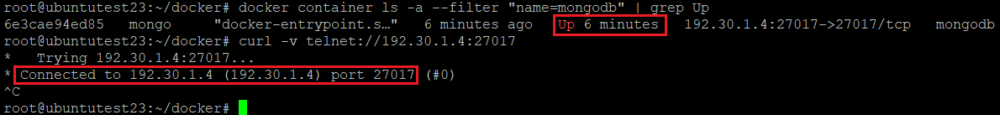

You can connect to the MongoDB Shell by executing command below.


#  /*  Connect to MongoDB container terminal  */
#  docker exec -it mongodb /bin/bash
#  
#  (Prompt will be changed)
#  /*  Connect to MongoDB Shell in container  */
#  mongosh mongodb://127.0.0.1:27017 -u root -p password



#  * mongosh -u  : mongoDB username. Please refer to option value of -e MONGO_INITDB_ROOT_USERNAME at the command creating container
#  * mongosh -p  : mongoDB password. Please refer to option value of -e MONGO_INITDB_ROOT_PASSWORD at the command creating container


You can see the result as below unless there is no issues.

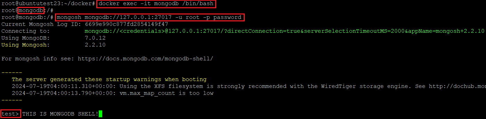

If you set the MONGO_INITDB_ROOT_USERNAME and MONGO_INITDB_ROOT_PASSWORD, 
You have to create database and collection manually and add user to database.
I will set the name of the database as 'logs'.


#  /*  create database  */
#  use logs
#
#  (Prompt will be changed to 'logs')
#  /*  create new user to 'logs' database
#  db.createUser({
#    user: "root",
#    pwd: "password", 
#    roles: [{ role: "readWrite", db: "logs" }]
#  })
# 
#  /* Check new user is created.
#  db.getUsers()



#  /* you can use passwordPrompt() instead of plain password "password".


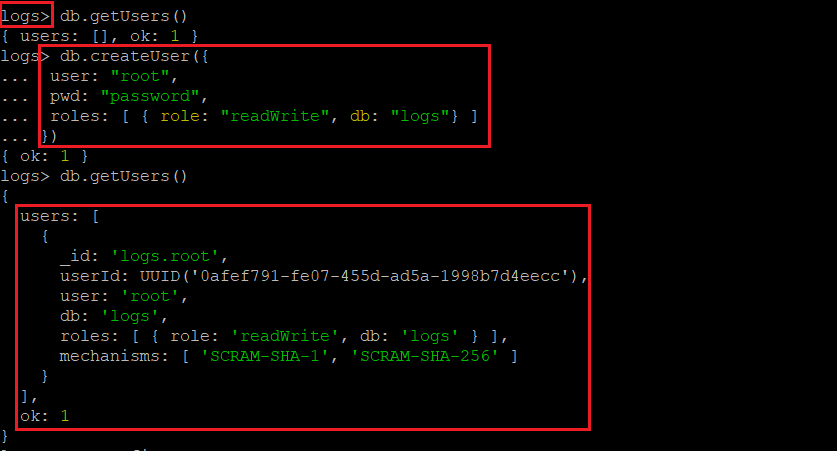

  
### 5. Create New Fluentd Image and Run Container

Next step is creating new fluentd Docker image. 
Official fluentd image does not have plug-in to forwarding logs to mongodb, so create new fluentd image containing mongodb plug-in.

First, Check the fluent/fluentd:edge-debian image is downloaded and stored on your machine.


#  /*  Check fluent/fluentd:edge-debian image on your machine  */
#  docker images --filter "reference=fluent/fluentd:edge-debian"


If the image exist, create empty folder and move to the created folder. 
Inside the folder, create file named' Dockerfile' to build a new fluentd equipping mongo plug-in.


#  /*  Creating empty folder and move to it.  */
#  sudo mkdir fluentd; cd fluentd
#
#  /*  Creating file named 'Dockerfile'  */
#  touch Dockerfile
#
#  /*  Editing 'Dockerfile'  */
#  vi Dockerfile


In Dockerfile, please write down the Dockerfile code to create new fluentd image.
Refer to the code below


#  /*  Dockerfile to create new fluentd image  */
#  FROM fluent/fluentd:edge-debian
#
#  USER root
#
#  RUN apt-get update && \
#      apt-get install -y build-essential libcurl4-gnutls-dev && \
#      apt-get clean && \
#      rm -rf /var/lib/apt/lists/*
#
#  RUN fluent-gem install fluent-plugin-mongo
#  
#  USER fluent
#  
#  COPY ./fluentd.conf /fluentd/etc/
#  
#  CMD ["fluentd", "-c", "/fluentd/etc/fluent.conf"]



#  * FROM :  Image as a base to create new docker image
#  * USER :  Change user in the base container.
#  * RUN  :  Executing command during create new image.
#  * COPY :  Making a copy of file and move it into the newly created container.
#  * CMD  :  Executing command when the image is run as a container.


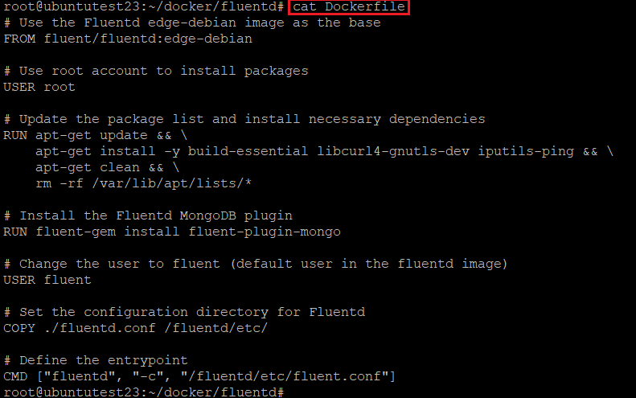

In Dockerfile, docker will copy the file 'fluentd.conf' to the new fluentd container. 
This conf file is important because it has setting values to run fluentd.
The host machine does not have this file yet, so just create file at the path where Dockerfile located in and fill out this conf file with content below.


#  /*  Creating file named 'fluentd.conf'  */
#  touch fluentd.conf
#
#  /*  Edit fluentd.conf  */
#  <source>
#    @type forward
#    port 24224 
#    bind 0.0.0.0
#  </source>
#
#  <match docker.log.**>
#    @type mongo
#    database logs
#    collection container
#    host 192.30.1.4
#    port 27017
#    user root
#    password password
#  </match>


The meanings of fluentd.conf are,  
-  fluentd will listen transmitted logs on the container's port 24224. 
-  fluentd will forward the log whose tag starts with 'docker.log.' to the mongodb. 
-  fluentd will store the forwarding logs on the document(table) named 'container' which located in database 'logs'. 

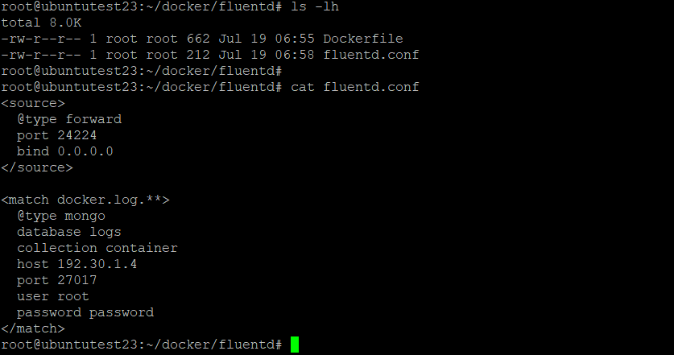

From now on, new fluentd docker image, which has mongodb plug-in, can be created. 
Move to the folder containing 'Dockefile' and 'fluentd.conf' and execute image build command below.


#  /*  Build new fluentd image containing mongodb plug-in  */
#  docker build -t fluentd-mongo:1.0 .


Once the building process is successfully completed, you can see the new fluentd docker images on your host.

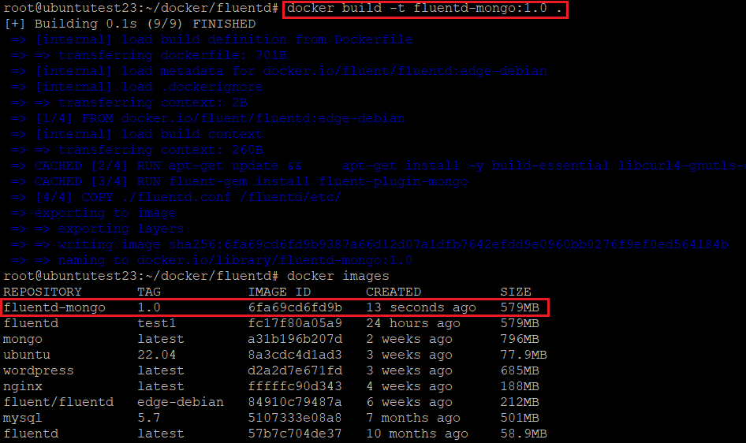

Now, run the newly created image with command below.


#  /*  Run fluentd images with mongodb plug-in  */
#  docker run -d --name fluentd --hostname fluentd \
#                --publish 192.30.1.4:24224:24224  \
#                --volume /root/docker/fluentd/fluentd.conf:/fluentd/etc/fluentd.conf \
#                fluentd-mongo:1.0 -c /fluentd/etc/fluentd.conf



#  * --name:      name of created container
#  * --hostname:  hostname of created container
#  * --publish :  set the port forwarding from host interface to docker container. 
#                 My host ip is 192.30.1.4.
#  * -- volume :  set the specific host folder to share its file with docker container. (optional)
#                 In this case, 'fluentd.conf' file on the host is shared by both host and fluentd container.
#  * -c        :  this is a fluentd command option. it will config fluentd service by refering /fluentd.conf file.


After running container, check the fluentd containers log by 'docker logs' command.


#  /*  Check the fluentd container log  */
#  docker logs fluentd


Log printed out will be show the config file that the fluentd service refered to. 
If the contents of config is different with 'fluentd.conf' you created, mongodb plugin does not work.
This phenomenon will be happened when you miss the fluentd's -c option.

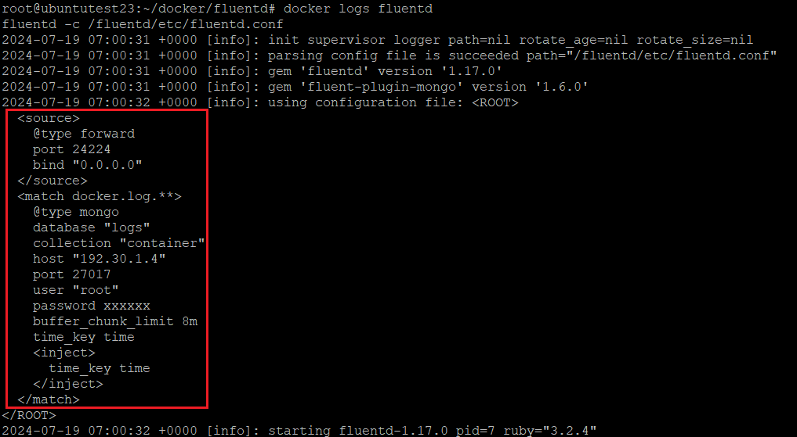

  
### 6. Run Container and Collecting Logs

Finally, this is the last stop. Let me set the log sending config for 'mysql' and 'nginx' container.
Before doing that, make sure that there is any database name 'log' on Mongo DB Container unless you did not set MONGO_INITDB variables.


#  /*  Connect to mongo container's terminal'  */
#  docker exec -it mongodb /bin/bash
#
#  (Prompt will be changed)
#  /*  Connect to MongoDB Shell  */
#  mongosh mongodb://127.0.0.1:27017 -u root -p password
# 
#  (Prompt will be changed)
#  /*  show all database in MongoDB container  */
#  show dbs;


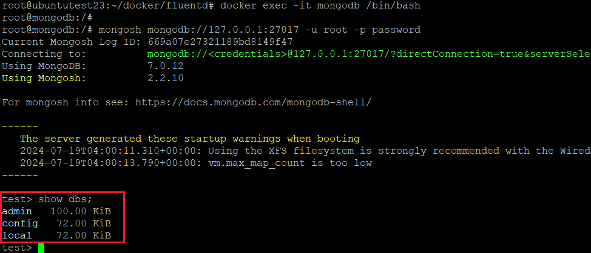


#  Please remind again that if you set the MONGO_INITDB_ROOT_USERNAME and MONGO_INITDB_ROOT_PASSWORD during creating mongodb container,
#  You have to create database and user for database manually.


As you can see the picture and your result, there is no database name 'logs'.
When the containers start to run, containers send their logs to fluentd and fluentd also forward logs to mongodb.
At the first time the mongodb recognise the forwarded log, it will create database 'logs' and collection 'container' in it.


#  /#  Run 'mysql' container with log sending setting.
#  docker run -d --name mysql --hostname mysql \
#                --log-driver fluentd \
#                --log-opt fluentd-address=192.30.1.4:24224 \
#                --log-opt tag=docker.log.mysql \
#                -e MYSQL_ROOT_PASSWORD=password \
#                mysql:5.7
#  
#  /#  Run 'nginx' container with log sending setting.
#  docker run -d --name nginx --hostname nginx \
#                --log-driver fluentd \
#                --log-opt fluentd-address=192.30.1.4:24224 \
#                --log-opt tag=docker.log.mysql \
#                nginx


Now, mysql container produces its log during start its service. you can make another nginx logs by accessing nginx website.

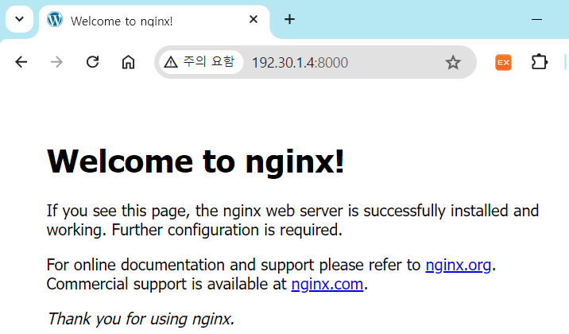

Access the mongodb shell again, see the data accumulated in the 'logs.container' collection.

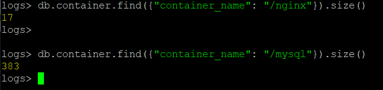
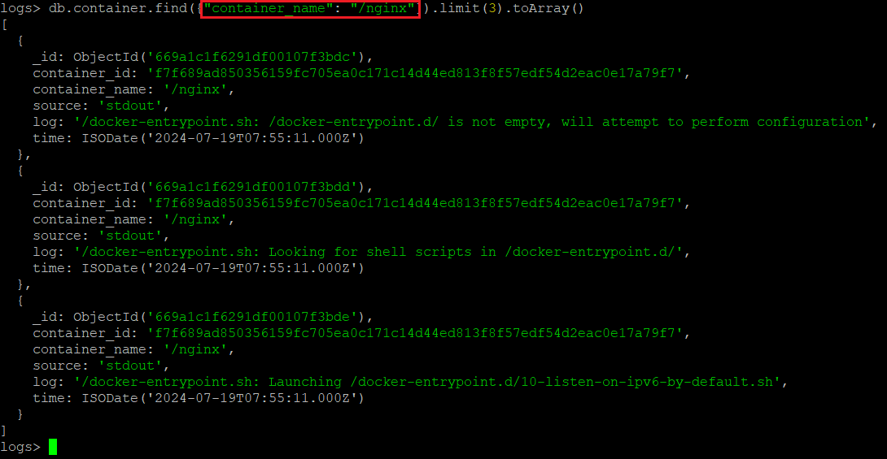
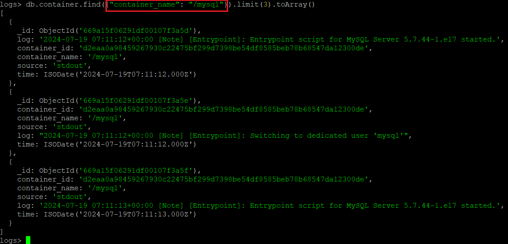

  
## Refernces

-  <a href="https://en.wikipedia.org/wiki/Fluentd">https://en.wikipedia.org/wiki/Fluentd</a> 
-  <a href="https://docs.docker.com/config/containers/logging/fluentd/#usage">https://docs.docker.com/config/containers/logging/fluentd/#usage</a> 
-  <a href="https://www.mongodb.com/docs/manual/reference/method/db.createUser/">https://www.mongodb.com/docs/manual/reference/method/db.createUser/</a> 

